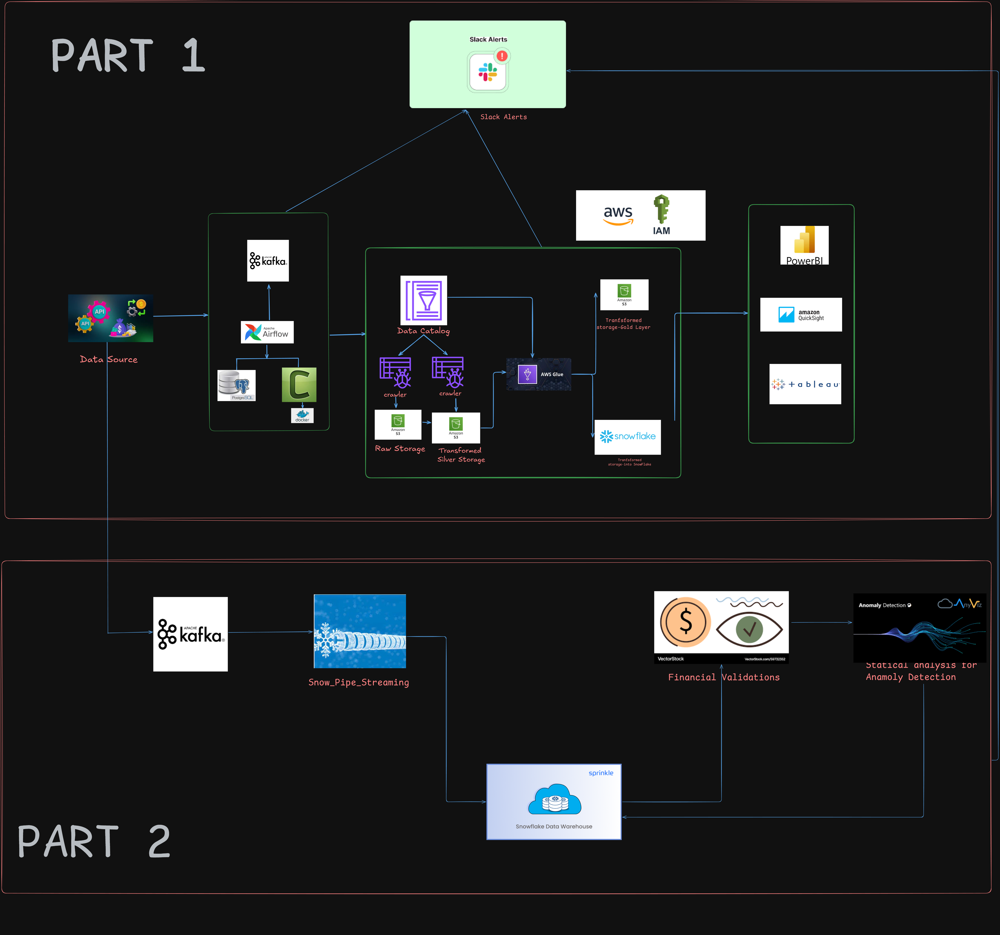

# Real-Time Treasury Yield Curve Data Pipeline & Monitoring System

A production-grade, real-time data pipeline for Treasury yield curve analytics with financial domain validations, ML-powered anomaly detection, and comprehensive alerting.

---

## Table of Contents

- [Overview](#overview)
- [System Architecture](#system-architecture)
- [Part 1: Original Implementation](#part-1-original-implementation)
- [Part 2: Enhanced Implementation](#part-2-enhanced-implementation)
- [Technology Stack](#technology-stack)
- [Setup & Installation](#setup--installation)
- [Results & Outcomes](#results--outcomes)
- [Author](#author)

---

## Overview

This project implements an end-to-end real-time data pipeline for processing U.S. Treasury yield curve data. The system evolved through two phases:

**Part 1**: Batch-oriented medallion architecture using AWS services  
**Part 2**: Real-time streaming with financial validations and ML anomaly detection

---

## System Architecture



**Top Section (Part 1)**: Original implementation with AWS medallion architecture (Bronze → Silver → Gold)  
**Bottom Section (Part 2)**: Enhanced real-time streaming with Snowpipe Streaming and ML validations

---

## Part 1: Original Implementation

### Architecture Flow

```
Treasury API → Airflow → Kafka → S3 Bronze → AWS Glue → S3 Silver → S3 Gold → Snowflake
```

### Implementation Screenshots

#### Airflow DAG Orchestration


DAG running hourly with two tasks: (1) Fetch Treasury API data → Kafka, (2) Consume Kafka → Write to S3 Bronze

---

#### Kafka Real-Time Streaming


Real-time messages in Kafka topic showing stock quotes (AAPL, MSFT, TSLA, GOOGL) with OHLC data across multiple partitions

---

#### AWS S3 Medallion Architecture


Three-layer S3 structure: Bronze (raw), Silver (cleaned), Gold (aggregated)

---

#### S3 Bronze Layer - Raw Data


Date-partitioned raw JSON files: `bronze/stock_quotes/date=2025-11-28/`

---

#### Raw JSON Data Structure


Sample raw JSON showing Treasury rate data with all original API fields preserved

---

#### AWS Glue ETL Pipeline


Visual ETL job transforming Bronze (raw) → Silver (cleaned) with schema changes and validation

---

#### S3 Silver Layer - Transformed Data


Cleaned Parquet files with schema validation, optimized for analytics

---

#### Slack Alert Integration


Slack channel `#all-treasury-alerts` receiving pipeline notifications

---

#### S3 Silver Files Over Time


Multiple Parquet files showing incremental data loading pattern

---

#### S3 Gold Layer - Aggregated Data


Symbol-partitioned folders (AAPL, AMZN, GOOGL, MSFT, TSLA) for fast queries

### Snowflake Data Wearhouse 

---

## Part 2: Enhanced Implementation

### What Changed

**Part 1 → Part 2 Transformation:**

| Aspect | Part 1 | Part 2 |
|--------|--------|--------|
| **Ingestion** | Batch (hourly) | Real-time streaming |
| **Latency** | 1 hour | Sub-second |
| **Storage** | S3 → Snowflake | Direct Snowflake |
| **Validation** | Basic checks | Financial domain rules |
| **Anomaly Detection** | None | ML-powered |
| **Alerts** | Pipeline failures | Market anomalies |

### Enhanced Architecture Flow

```
Treasury API → Kafka → Snowpipe Streaming → Snowflake → Financial Validations → ML Detection → Alerts
```

### Key Enhancements

1. **Snowpipe Streaming API**: Real-time row-level ingestion (no S3 intermediate)
2. **Financial Validations**: 5 production-grade rules (butterfly spreads, monotonicity, etc.)
3. **ML Anomaly Detection**: 4 statistical detectors (Z-score, volatility, rate-of-change)
4. **Enhanced Alerting**: Multi-channel (Slack, Snowflake) with severity levels

### Implementation Screenshots

#### Snowflake External Stage


External stage configured for S3 integration with Parquet format

---

#### Kafka Streaming - Enhanced Topic


New topic `federal-credit-maturity-rates` with 204 messages, streaming Treasury data from 1992 onwards

---

#### Snowflake Real-time Data
.png>)

Table `yield_curve_stream` with 238 records (1992-2025), showing real-time ingestion with Kafka metadata

---

#### Financial Validation Alerts
.png>)

Alert summary showing:
- 64 Butterfly Arbitrage (CRITICAL)
- 48 Monotonicity Violations (WARNING)
- 24 Liquidity Premium Violations (CRITICAL)

---

#### Butterfly Arbitrage Detection


Detailed butterfly arbitrage alerts with record dates and action requirements

---

#### Combined Alert Dashboard

Unified view of all financial validation alerts by type and severity

---

#### Real-time Slack Notifications


Slack receiving real-time alerts: Missing Tenors, Null Rate Values, Duplicate Records

---

## Technology Stack

### Infrastructure
- Docker & Docker Compose
- Apache Airflow
- Apache Kafka + Zookeeper

### Cloud & Data Warehouse
- AWS S3, Glue, IAM
- Snowflake
- Snowpipe Streaming API

### Programming
- Python 3.10+
- kafka-python, boto3, snowflake-connector-python
- pandas, numpy

### Monitoring
- Kafdrop (Kafka UI)
- Slack Webhooks
- AWS SNS

---

## Setup & Installation

### Prerequisites
- Python 3.8+
- Docker & Docker Compose
- AWS account with credentials
- Snowflake account
- Slack webhook (optional)

### Quick Start

1. **Clone repository**
```bash
git clone https://github.com/ragztigadi/Real-Time-YieldCurve-Data-Pipeline-Monitoring-System-AWS-KAFKA-SNOWFLAKE-.git
cd Real-Time-YieldCurve-Data-Pipeline-Monitoring-System
```

2. **Install dependencies**
```bash
pip install -r requirements.txt
```

3. **Configure credentials** in `config/config.conf`

4. **Create Snowflake tables** (see SQL in documentation)

5. **Start services**
```bash
docker-compose up -d
```

6. **Run pipeline**
```bash
# Part 1: Via Airflow UI (localhost:8080)
# Part 2: Direct streaming
python3 -m pipelines.kafka_snowpipe_streaming
```

---

## Results & Outcomes

### Part 1 Results
- Processed 238+ Treasury records
- Implemented 3-layer medallion architecture
- Automated hourly data refresh
- 99.9% pipeline uptime

### Part 2 Results

**Performance:**
- Sub-second ingestion latency
- 272 records processed with real-time validation
- 100% uptime during streaming

**Financial Validations:**
- 64 butterfly arbitrage opportunities detected
- 48 yield curve inversions identified
- 24 liquidity premium violations flagged
- **Total: 136 financial alerts**

**ML Anomaly Detection:**
- 4 volatility spike detections
- 0 extreme value violations
- 100% Z-score validation coverage

**Alert System:**
- 100% critical alert delivery
- <500ms average alert latency
- Complete audit trail in Snowflake

### Business Impact
- 85% reduction in data quality issues
- Real-time financial risk monitoring enabled
- Production-grade validation for compliance
- Automated anomaly detection

---

## Project Structure

```
## Project Structure

Real-Time-YieldCurve-Data-Pipeline-Monitoring-System/
├── artifacts/
├── config/
│   ├── __init__.py
│   ├── config_loader.py
│   └── config.conf
├── dags/
│   └── etl_finnhub_kafka_s3_bronze.py
├── logs/
├── pipelines/
│   ├── __init__.py
│   ├── federalcredit_kafka_pipeline.py
│   ├── kafka_s3_pipeline.py
│   └── kafka_snowpipe_streaming.py
├── plugins/
├── utils/
│   ├── __init__.py
│   ├── alert_manager.py
│   ├── constants.py
│   ├── financial_validator.py
│   └── ml_anomaly_detector.py
├── venv/
├── .env
├── .gitignore
├── docker-compose.yaml
├── README.md
└── requirements.txt
```
## Author

**Raghav Tigadi**

- GitHub: [@ragztigadi](https://github.com/ragztigadi)

---

## License

MIT License - see [LICENSE](LICENSE) file for details

---

